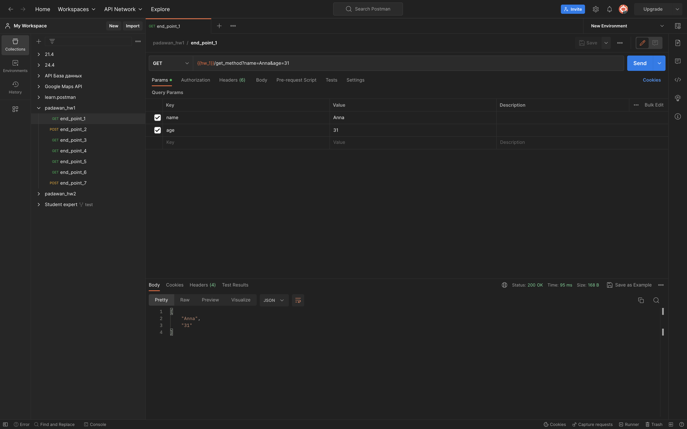
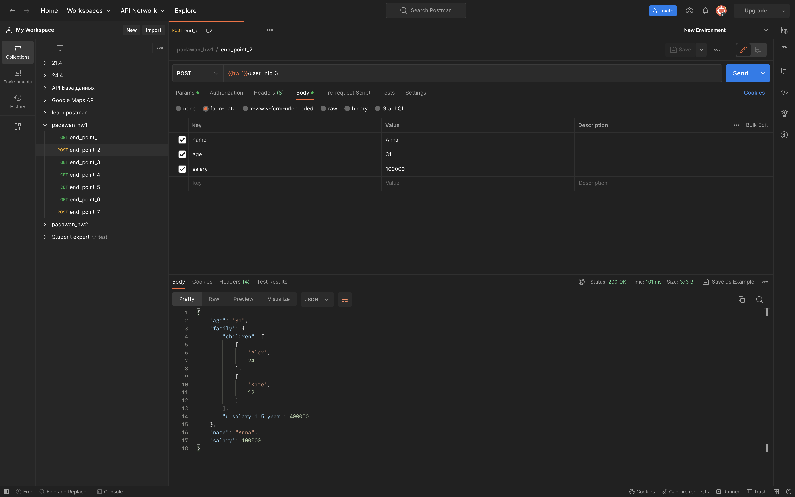
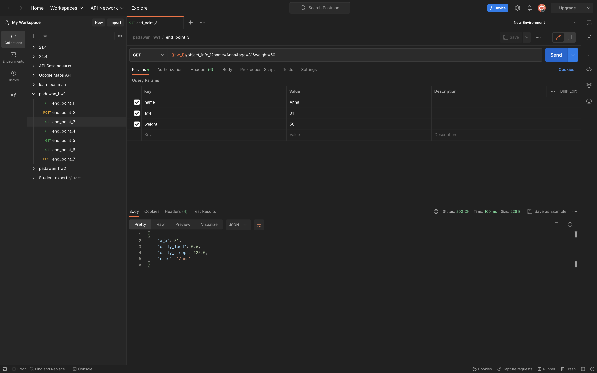
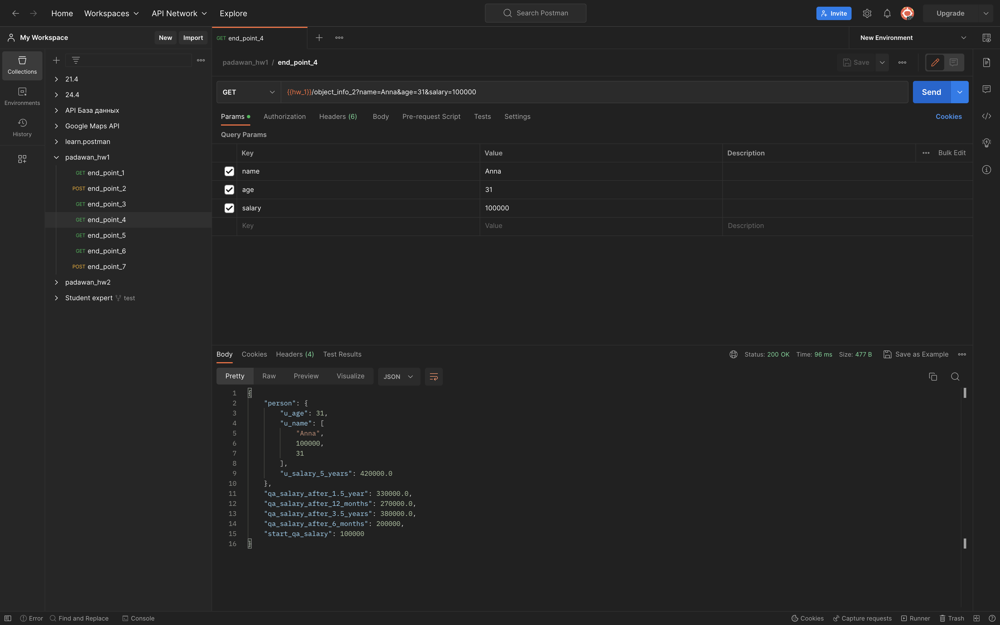
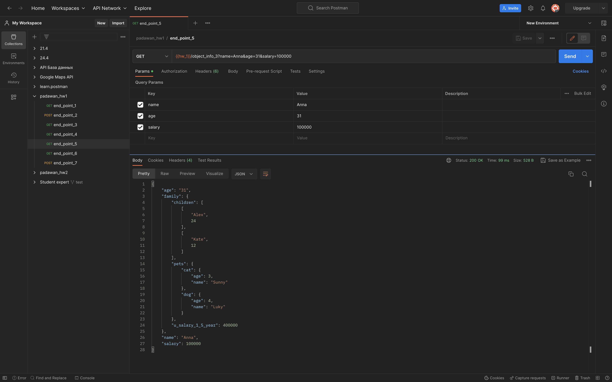
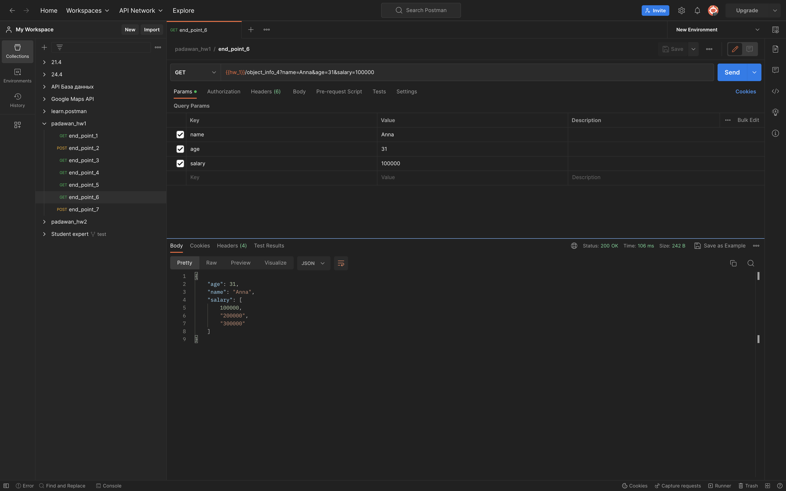
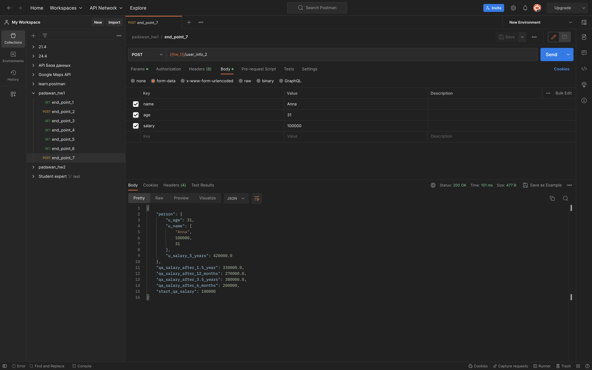

<h2>CREATE REQUESTS IN POSTMAN</h2>

Protocol: http

IP: 162.55.220.72

Port: 5005

<ul><h3 style="color:#28B5B1">end_point_1</h3>
    <li>method: <b>GET</b></li>
    <li>end_point: /get_method</li>
    <li>request url params:
        <ul>
            <li>name: str</li>
            <li>age: int</li>
        </ul>
    </li>
</ul>

>response:

---

<ul><h3 style="color:#28B5B1">end_point_2</h3>
    <li>method: <b>POST</b></li>
    <li>end_point: /user_info_3</li>
    <li>request url params:
        <ul>
            <li>name: str</li>
            <li>age: int</li>
            <li>salary: int</li>
        </ul>
    </li>
</ul>

>response

---
<ul><h3 style="color:#28B5B1">end_point_3</h3>
    <li>method: <b>GET</b></li>
    <li>end_point: /object_info_1</li>
    <li>request url params:
        <ul>
            <li>name: str</li>
            <li>age: int</li>
            <li>salary: int</li>
        </ul>
    </li>
</ul>

>response

---
<ul><h3 style="color:#28B5B1">end_point_4</h3>
    <li>method: <b>GET</b></li>
    <li>end_point: /object_info_2</li>
    <li>request url params:
        <ul>
            <li>name: str</li>
            <li>age: int</li>
            <li>salary: int</li>
        </ul>
    </li>
</ul>

>response

---
<ul><h3 style="color:#28B5B1">end_point_5</h3>
    <li>method: <b>GET</b></li>
    <li>end_point: /object_info_3</li>
    <li>request url params:
        <ul>
            <li>name: str</li>
            <li>age: int</li>
            <li>salary: int</li>
        </ul>
    </li>
</ul>

>response

---
<ul><h3 style="color:#28B5B1">end_point_6</h3>
    <li>method: <b>GET</b></li>
    <li>end_point: /object_info_4</li>
    <li>request url params:
        <ul>
            <li>name: str</li>
            <li>age: int</li>
            <li>salary: int</li>
        </ul>
    </li>
</ul>

>response

---
<ul><h3 style="color:#28B5B1">end_point_7</h3>
    <li>method: <b>POST</b></li>
    <li>end_point: /user_info_2</li>
    <li>request url params:
        <ul>
            <li>name: str</li>
            <li>age: int</li>
            <li>salary: int</li>
        </ul>
    </li>
</ul>

>response

---
