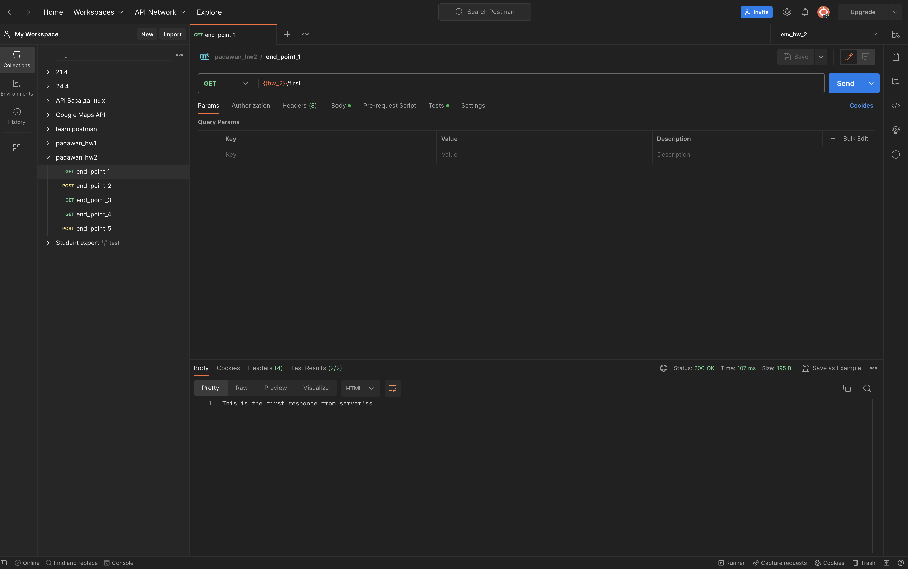
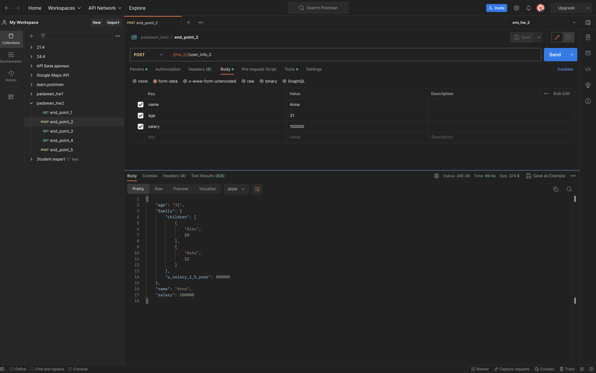
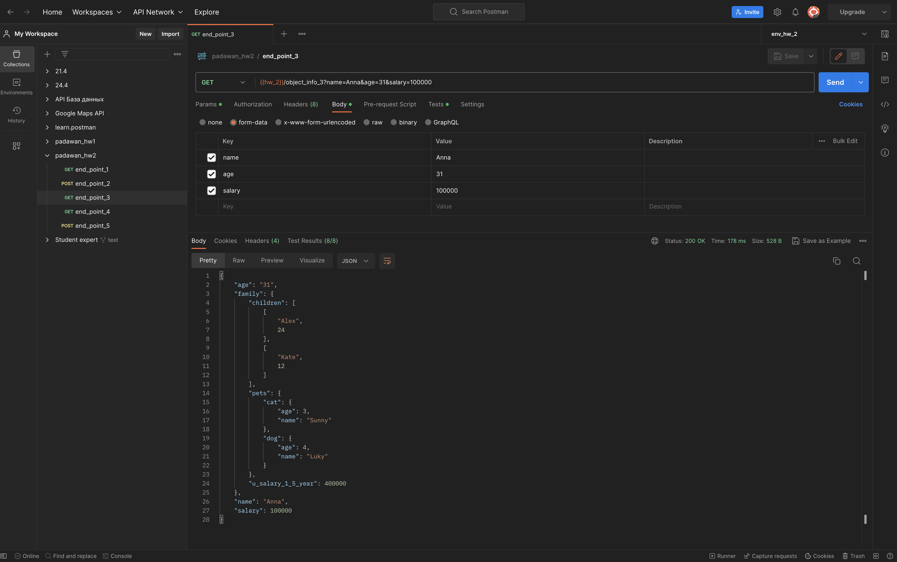
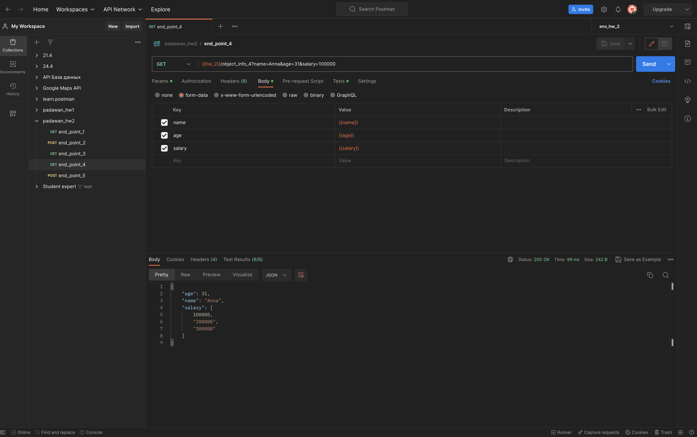
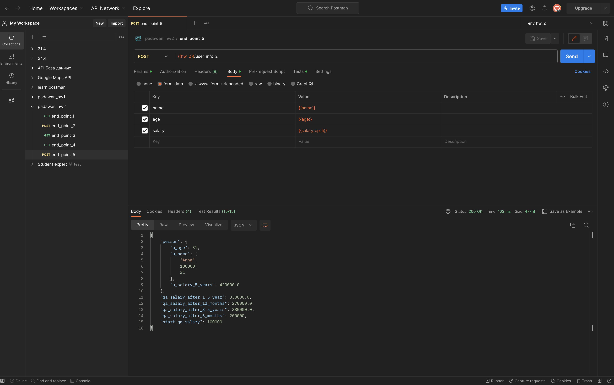

$${\color{#28B5B1}endPoint1}$$
#### 1. Send request:
```
http://162.55.220.72:5005/first
```
#### 2. Check that the status code of the request is 200:
```javascript
pm.test("Status code is 200", function () {
    pm.response.to.have.status(200);
});
```
#### 3. Check that the correct string is received in body:
```javascript
pm.test("Body matches string", function () {
    pm.expect(pm.response.text()).to.include("This is the first responce from server!ss");
});
```


___
$${\color{#28B5B1}endPoint2}$$
#### 1. Send request:
```
http://162.55.220.72:5005/user_info_3
```
#### 2. Check that the status code of the request is 200:
```javascript
pm.test("Status code is 200", function () {
    pm.response.to.have.status(200);
});
```
#### 3. Parse response body to json:
```javascript
const resBody = pm.response.json();
```
#### 4. Check that the name in the response is equal to the name in the request(name write by hand):
```javascript
pm.test('Response body name is Anna', function () {
    pm.expect(resBody.name).to.eql('Anna');
});
```
#### 5. Check that the age in the response is equal to the age in the request(age write by hand):
```javascript
pm.test('Response body age is 31', function () {
    pm.expect(resBody.age).to.eql('31');
});
```
#### 6. Check that the salary in the response is equal to the salary in the request(salary write by hand):
```javascript
pm.test('Response body salary is 100000', function () {
    pm.expect(resBody.salary).to.eql(100000);
});
```
#### 7. Parse request:
```javascript
const reqData = request.data;
```
#### 8. Check that the name in the response is equal to the name in the request(name to take from request):
```javascript
pm.test('Response name equal request name', function () {
    pm.expect(resBody.name).to.eql(reqData.name);
});
```
#### 9. Check that the age in the response is equal to the age in the request(age to take from request):
```javascript
pm.test('Response age equal request age', function () {
    pm.expect(resBody.age).to.eql(reqData.age);
});
```
#### 10. Check that the salary in the response is equal to the salary in the request(salary to take from request):
```javascript
pm.test('Response salary equal request salary', function () {
    pm.expect(resBody.salary).to.eql(parseInt(reqData.salary));
});
```
#### 11. Output the family parameter from response to the console:
```javascript
console.log(resBody.family);
```
#### 12. Check that the u_salary_1_5_year in the response is equal to the salary*4(salary to take from request):
```javascript
pm.test('Response \'u_salary_1_5_year\' equal request salary * 4', function () {
    pm.expect(resBody.family.u_salary_1_5_year).to.eql(parseInt(reqData.salary) * 4);
});
```


___
$${\color{#28B5B1}endPoint3}$$
#### 1. Send request:
```
http://162.55.220.72:5005/object_info_3
```
#### 2. Check that the status code of the request is 200:
```javascript
pm.test('Response status code is 200', function () {
    pm.response.to.have.status(200);
});
```
#### 3. Parse response body to json:
```javascript
const resBody = pm.response.json();
```
#### 4. Parse request:
```javascript
const reqData = request.data;
```
#### 5. Check that the name in the response is equal to the name in the request(name take from request):
```javascript
pm.test('Response name equal request name', function () {
    pm.expect(resBody.name).to.eql(reqData.name);
});
```
#### 6. Check that the age in the response is equal to the age in the request(age take from request):
```javascript
pm.test('Response age equal request age', function () {
    pm.expect(resBody.age).to.eql(reqData.age);
});
```
#### 7. Check that the salary in the response is equal to the salary in the request(salary take from request):
```javascript
pm.test('Response salary equal request salary', function () {
    pm.expect(resBody.salary).to.eql(parseInt(reqData.salary))
});
```
#### 8. Output the 'family' parameter from response to the console:
```javascript
console.log(resBody.family);
```
#### 9. Check that the 'dog' parameter has 'name' parameter:
```javascript
pm.test('The \'dog\' object should contain the \'name\' parameter', function () {
    pm.expect(resBody.family.pets.dog).to.have.property('name');
});
```
#### 10. Check that the 'dog' parameter has 'age' parameter:
```javascript
pm.test('The \'dog\' object should contain the \'age\' parameter', function () {
    pm.expect(resBody.family.pets.dog).to.have.property('age');
});
```
#### 11. Check that the 'name' parameter has a value 'Luky':
```javascript
pm.test('The \'dog\' name is \'Lucky\'', function () {
    pm.expect(resBody.family.pets.dog.name).to.eql('Luky');
});
```
#### 12. Check that the 'age' parameter is 4:
```javascript
pm.test('The \'dog\' age is 4', function () {
    pm.expect(resBody.family.pets.dog.age).to.eql(4);
});
```


___
$${\color{#28B5B1}endPoint4}$$
#### 1. Send request:
```
http://162.55.220.72:5005/object_info_4
```
#### 2. Check that the status code of the request is 200:
```javascript
pm.test('Response status code is 200', function () {
    pm.response.to.have.status(200);
});
```
#### 3. Parse response body to json:
```javascript
const resBody = pm.response.json();
```
#### 4. Parse request:
```javascript
const reqData = request.data;
```
#### 5. Check that the name in the response is equal to the name in the request(name take from request):
```javascript
pm.test('Response name equal request name', function () {
    pm.expect(resBody.name).to.eql(reqData.name);
});
```
#### 6. Check that the age in the response is equal to the age in the request(age take from request):
```javascript
pm.test('Response age equal request age', function () {
    pm.expect(resBody.age).to.eql(parseInt(reqData.age));
});
```
#### 7. Output the 'salary' parameter from request to the console: 
```javascript
console.log('reqDataSalaryArray', reqDataSalaryArray);
```
#### 8. Output the 'salary' parameter from response to the console: 
```javascript
console.log('resBody.salary', resBody.salary);
```
#### 9. Output the element[0] of the 'salary' parameter from response to the console:
```javascript
console.log('resBody.salary[0]', resBody.salary[0]);
```
#### 10. Output the element[1] of the 'salary' parameter from response to the console:
```javascript
console.log('resBody.salary[1]', resBody.salary[1]);
```
#### 11. Output the element[2] of the 'salary' parameter from response to the console:
```javascript
console.log('resBody.salary[2]', resBody.salary[2]);
```
#### 12. Check that the element[0] of the 'salary' parameter is equal to the salary from request(salary take from request):
```javascript
pm.test('\'0\'salary parameter is equal to the salary from request', function () {
    pm.expect(resBody.salary[0]).to.eql(parseInt(reqDataSalaryArray[0]));
});
```
#### 13. Check that the element[1] of the 'salary' parameter is equal to the salary*2 from request(salary take from request):
```javascript
pm.test('\'1\'salary parameter is equal to the salary from request', function () {
    pm.expect(parseInt(resBody.salary[1])).to.eql(parseInt(reqDataSalaryArray[1]));
});
```
#### 14. Check that the element[2] of the 'salary' parameter is equal to the salary*3 from request(salary take from request):
```javascript
pm.test('\'2\'salary parameter is equal to the salary from request', function () {
    pm.expect(parseInt(resBody.salary[2])).to.eql(parseInt(reqDataSalaryArray[2]));
});
```
#### 15. Create a 'name' variable in the environment:
```javascript
const resBodyName = resBody.name;
```
#### 16. Create an 'age' variable in the environment:
```javascript
const resBodyAge = resBody.age;
```
#### 17. Create a 'salary' variable in the environment:
```javascript
const resBodySalary = resBody.salary;
```
#### 18. Pass the 'name' variable to the environment:
```javascript
pm.environment.set('name', resBodyName);
```
#### 19. Pass the 'age' variable to the environment:
```javascript
pm.environment.set('age', resBodyAge);
```
#### 20. Pass the 'salary' variable to the environment:
```javascript
pm.environment.set('salary', resBodySalary);
pm.environment.set('salary_ep_5', resBodySalary[0]);
```
#### 21. Write a loop that ouyputs the elements of the list from the 'salary' parameter to the console in order:
```javascript
for (const salary of resBodySalary) {
  console.log(salary);
};
```


---
$${\color{#28B5B1}endPoint5}$$
#### 1. Insert the 'salary' parameter from the environment into request:
#### 2. Insert the 'age' parameter from the environment into request:
#### 3. Insert the 'name' parameter from the environment into request:
#### 4. Send request:
```
http://162.55.220.72:5005/user_info_2
```
#### 5. Check that the status code of the request is 200:
```javascript
pm.test('Response status code is 200', function () {
    pm.response.to.have.status(200);
});
```
#### 6. Parse response body to json:
```javascript
const resBody = pm.response.json();
```
#### 7. Parse request:
```javascript
const reqData = request.data;
```
#### 8. Check that the json response has a 'start_qa_salary' parameter:
```javascript
pm.test('Json response has \'start_qa_salary\' parameter', function () {
    pm.expect(resBody).to.have.property('start_qa_salary');
});
```
#### 9. Check that the json response has a parameter 'start_qa_salary_after_6_months':
```javascript
pm.test('Json response has \'qa_salary_after_6_months\' parameter', function () {
    pm.expect(resBody).to.have.property('qa_salary_after_6_months');
});
```
#### 10. Check that the json response has a 'start_qa_salary_after_12_months' parameter:
```javascript
pm.test('Json response has \'qa_salary_after_12_months\' parameter', function () {
    pm.expect(resBody).to.have.property('qa_salary_after_12_months');
});
```
#### 11. Check that the json response has a 'start_qa_salary_after_1.5_year' parameter:
```javascript
pm.test('Json response has \'qa_salary_after_1.5_year\' parameter', function () {
    pm.expect(resBody).to.have.property('qa_salary_after_1.5_year');
});
```
#### 12. Check that the json response has a 'start_qa_salary_after_3.5_year' parameter:
```javascript
pm.test('Json response has \'qa_salary_after_3.5_years\' parameter', function () {
    pm.expect(resBody).to.have.property('qa_salary_after_3.5_years');
});
```
#### 13. Check that the json response has a 'person' parameter:
```javascript
pm.test('Json response has \'person\' parameter', function () {
    pm.expect(resBody).to.have.property('person');
});
```
#### 14. Check that the 'start_qa_salary' parameter is equal to the salary from request(salary take from request):
```javascript
pm.test('\'start_qa_salary\' parameter is equal to the salary from request', function () {
    pm.expect(resBody.start_qa_salary).to.eql(parseInt(reqData.salary));
});
```
#### 15. Check that the 'qa_salary_after_6_months' parameter is equal to the salary*2 from request(salary take from request):
```javascript
pm.test('\'qa_salary_after_6_months\' parameter is equal to the salary from request', function () {
    pm.expect(resBody.qa_salary_after_6_months).to.eql(parseInt(reqData.salary) * 2);
});
```
#### 16. Check that the 'qa_salary_after_12_months' parameter is equal to the salary*2.7 from request(salary take from request):
```javascript
pm.test('\'qa_salary_after_12_months\' parameter is equal to the salary from request', function () {
    pm.expect(resBody.qa_salary_after_12_months).to.eql(parseInt(reqData.salary) * 2.7);
});
```
#### 17. Check that the 'qa_salary_after_1.5_year' parameter is equal to the salary*3.3 from request(salary take from request):
```javascript
pm.test('\'qa_salary_after_1.5_year\' parameter is equal to the salary from request', function () {
    pm.expect(resBody['qa_salary_after_1.5_year']).to.eql(parseInt(reqData.salary) * 3.3);
});
```
#### 18. Check that the 'qa_salary_after_3.5_years' parameter is equal to the salary*3.8 from request(salary take from request):
```javascript
pm.test('\'qa_salary_after_3.5_years\' parameter is equal to the salary from request', function () {
    pm.expect(resBody['qa_salary_after_3.5_years']).to.eql(parseInt(reqData.salary) * 3.8);
});
```
#### 19. Check that in the 'person' parameter, the 1st element from 'u_name' is equal to salary from request(salary take from request):
```javascript
pm.test('The first \'u_name\' parameter is equal to the salary from request', function () {
pm.expect(resBody.person.u_name[1]).to.eql(parseInt(reqData.salary));
});
```
#### 20. Check that the 'u_age' parameter is equal to the age from request(salary take from request):
```javascript
pm.test('\'u_age\' parameter is equal to the age from request', function () {
pm.expect(resBody.person.u_age).to.eql(parseInt(reqData.age));
});
```
#### 21. Check that the 'u_salary_5_years' parameter is equal to the salary*4.2 from request(salary take from request):
```javascript
pm.test('\'u_salary_5_years\' parameter is equal to the salary from request', function () {
    pm.expect(resBody.person.u_salary_5_years).to.eql(parseInt(reqData.salary) * 4.2);
});
```
#### 22. Write a loop that outputs the elements of the list from the 'person' parameter to the console in order:
```javascript
for (let item in resBody.person) {
    console.log(resBody.person[item])};
```


___