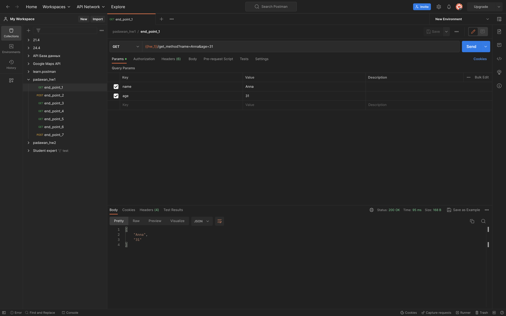
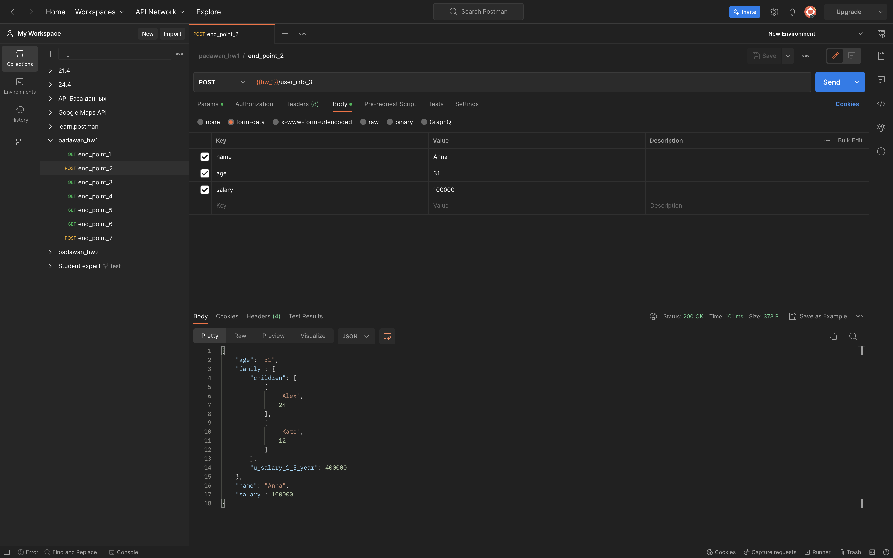
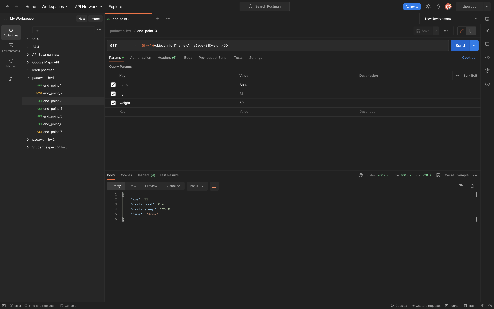
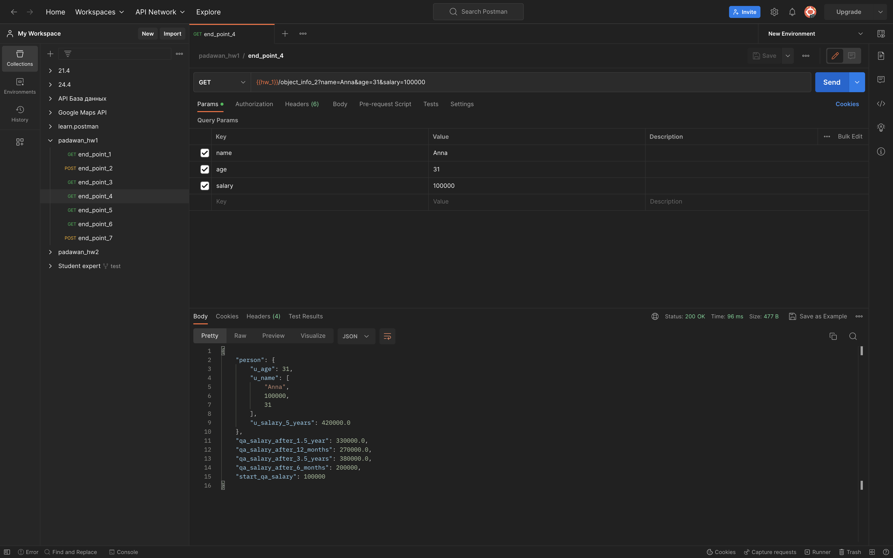
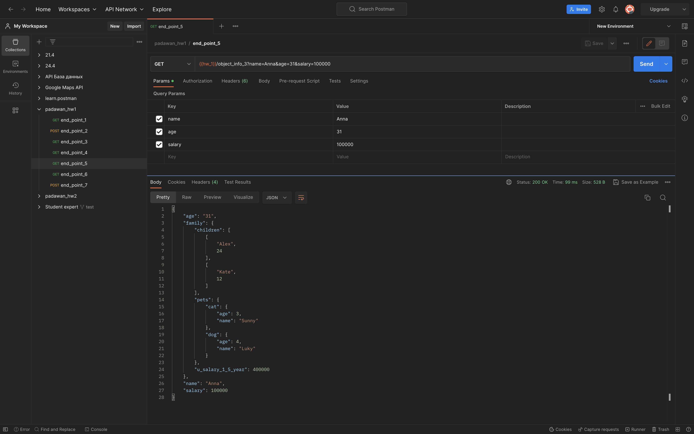
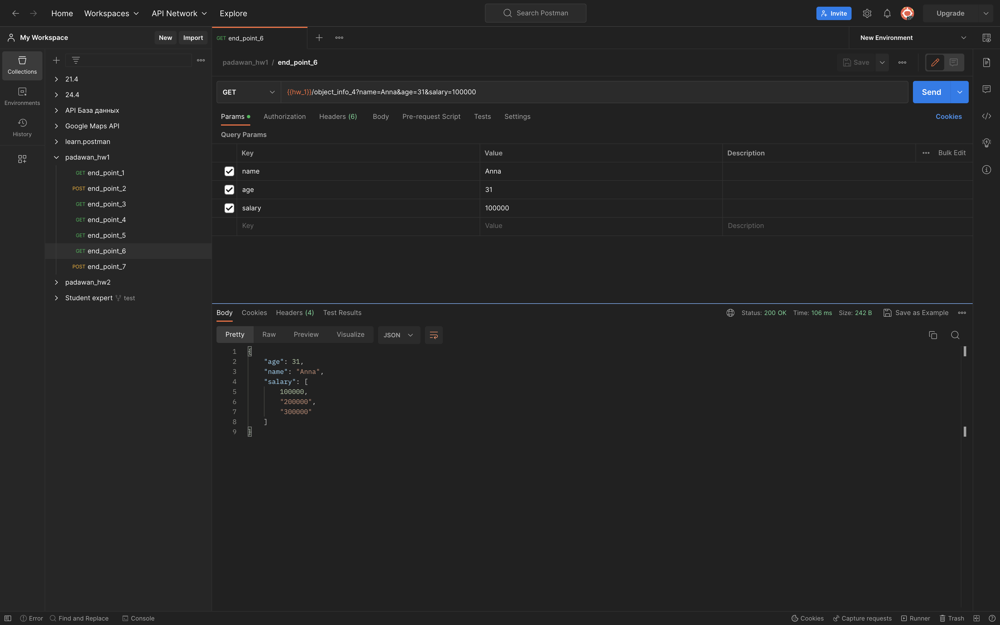
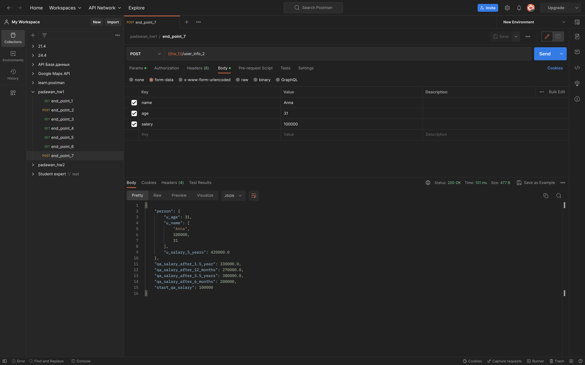

### CREATE REQUESTS IN Postman
#### Protocol: http
#### IP: 162.55.220.72
#### Port: 5005
___
>end_point_1
* method: ```GET```
* end_point: /get_method
* request url params: 
    * name: str
    * age: int
>response



---
>end_point_2
* method: ```POST```
* end_point: /user_info_3
* request url params: 
    * name: str
    * age: int
    * salary: int
>response



---
>end_point_3
* method: ```GET```
* end_point: /object_info_1
* request url params: 
    * name: str
    * age: int
    * salary: int
>response



---
>end_point_4
* method: ```GET```
* end_point: /object_info_2
* request url params: 
    * name: str
    * age: int
    * salary: int
>response



---
>end_point_5
* method: ```GET```
* end_point: /object_info_3
* request url params: 
    * name: str
    * age: int
    * salary: int
>response



---
>end_point_6
* method: ```GET```
* end_point: /object_info_4
* request url params: 
    * name: str
    * age: int
    * salary: int
>response



---
>end_point_7
* method: ```POST```
* end_point: /user_info_2
* request url params: 
    * name: str
    * age: int
    * salary: int
>response



---
